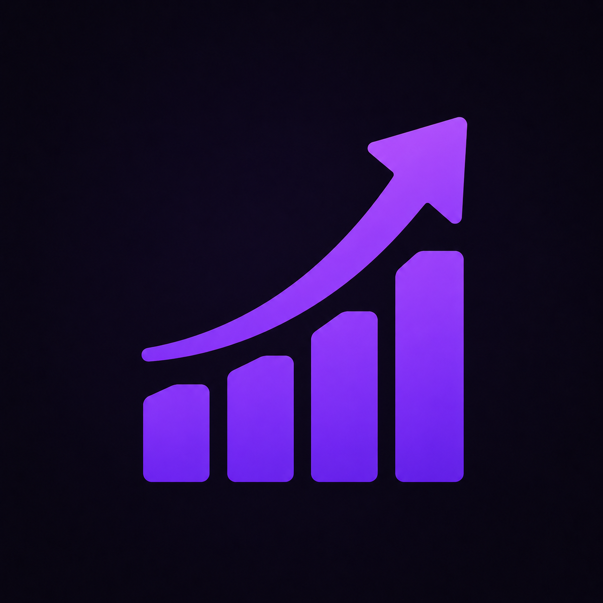

# FinTrack

Controle financeiro pessoal com **dashboard**, **transações**, **orçamento mensal**, **parcelas/recorrências**, **dimensões financeiras** e um módulo auxiliar de **filmes**. Feito com **React + TypeScript + Vite**, **Tailwind + shadcn/ui**, **Recharts**, **Framer Motion** e **Supabase** (auth e banco).

<p align="center">
  
</p>

---

## ✨ Recursos principais

- **Autenticação**: Google OAuth (Supabase Auth).
- **Dashboard**: saldo, receita total, despesa total, gráficos de tendência e transações do mês.
- **Transações**: criação/edição/exclusão com natureza (Receita/Despesa) e classificação por Dimensões.
- **Parcelas/Recorrências**: cadastre despesas/receitas recorrentes (Semanal, Mensal, Anual) e acompanhe a projeção.
- **Orçamento mensal**: acompanhe planejado, gasto, restante, projeções e sugestões por média histórica.
- **Dimensões**: **Tipos** (cor, ícone, natureza) e **Classes** (subcategorias) para enriquecer relatórios.
- **Filmes**: organize filmes para assistir e assistidos, com busca via OMDb.
- **UI moderna**: Tailwind + shadcn/ui (Radix), ícones Lucide, animações com Framer, gráficos com Recharts.
- **SPA pronta para deploy** (Vercel) — `vercel.json` já inclui rewrite para SPA.

---

## 🧱 Stack

- **Front-end**: React 19, TypeScript, Vite
- **Estilos/UX**: Tailwind CSS, shadcn/ui (Radix), Lucide Icons, Framer Motion
- **Gráficos**: Recharts
- **Dados/Auth**: Supabase (`@supabase/supabase-js`)
- **Tabela/DataGrid**: TanStack Table
- **Roteamento**: React Router v7 (rotas protegidas + lazy loading)

---

## 📂 Estrutura do projeto (resumo)

```
/public
  ├─ logo.webp
  └─ placeholder.svg

/src
  ├─ api/                # acesso ao Supabase e serviços por domínio
  ├─ components/         # componentes de UI (inclui /ui com shadcn)
  ├─ hooks/              # hooks (auth, db, UI, etc.)
  ├─ layouts/            # AdminLayout, DefaultLayout
  ├─ lib/                # supabase client, utils
  ├─ pages/              # telas (admin/home, admin/finance, admin/movies, Login)
  ├─ types/              # tipagens por domínio
  ├─ routes.tsx          # roteamento com ProtectedRoute
  ├─ ProtectedRoute.tsx  # guarda de rota (redireciona para /login se não autenticado)
  ├─ main.tsx            # bootstrap da app
  └─ index.css           # estilos globais
```

> Dica: os componentes shadcn estão em `src/components/ui/*` e o Sidebar/App layout em `src/components/app-sidebar.tsx`, `src/layouts/AdminLayout.tsx`.

---

## 🗃️ Modelo de dados (Supabase)

Tabelas **utilizadas pelo front** (consulta/CRUD via Supabase):

- `nature` — natureza (Receita/Despesa)
- `type` — tipos (nome, cor, ícone, natureza, order)
- `class` — classes (pertencem a um `type`)
- `transaction` — transações avulsas (valor, data, descrição, class_id)
- `recurring_transaction` — recorrências (valor, frequência, validade, class_id, status)
- `monthly_budget` — orçamento mensal por tipo/classe
- `movie` — catálogo pessoal de filmes
- Views auxiliares: `vw_recurring_transaction_with_nature`, `vw_value_by_nature_year_month`, `vw_monthly_budget_summary`
- RPC auxiliar: `get_monthly_budget_suggestions`

> Crie essas tabelas via **SQL do Supabase** (seu schema) ou migrações. Ajuste nomes/colunas conforme sua modelagem. O app espera esses nomes conforme o código em `src/api/*.ts` e `src/types/*.ts`.

---

## 🚀 Começando

### 1) Pré‑requisitos
- **Node.js 18+** (recomendado **20+**)
- **Yarn** (ou **npm**/**pnpm**)
- Conta no **Supabase** (URL e ANON KEY do seu projeto)

### 2) Configurar variáveis de ambiente
Crie `.env` na raiz (ou copie de `.env.example`) e preencha:

```bash
VITE_SUPABASE_URL= https://SEU-PROJETO.supabase.co
VITE_SUPABASE_ANON_KEY= <sua_anon_key>
```

### 3) Instalar dependências
```bash
yarn        # ou: npm i  /  pnpm i
```

### 4) Rodar em desenvolvimento
```bash
yarn dev
# App em: http://localhost:5173
```

### 5) Build e preview
```bash
yarn build
yarn preview  # serve build localmente
```

### 6) Produção (SPA)
```bash
yarn build
yarn start    # usa 'serve' para servir /dist
```

---

## 🔐 Autenticação

- **Login com Google** via Supabase Auth.
- `src/lib/supabase.ts` inicializa o client com `VITE_SUPABASE_URL` e `VITE_SUPABASE_ANON_KEY`.
- `ProtectedRoute` + `useAuth` protegem rotas (`/admin/*`).

---

## 🧭 Fluxo de uso (resumo)

1. **Login** com Google.
2. Chegue ao **Dashboard**: saldo, receitas/despesas, gráficos, transações do mês.
3. **Dimensões** → cadastre **Tipos** (cor, ícone, natureza) e **Classes**.
4. **Transações** → lance receitas/despesas do dia a dia.
5. **Orçamento** → planeje gastos/receitas por mês e acompanhe estouros.
6. **Parcelas** → crie recorrências e marque parcelas pagas.
7. **Filmes** → organize sua lista de filmes.

---

## 🛠 Scripts

- `yarn dev` — ambiente de desenvolvimento (Vite)
- `yarn build` — build de produção (Vite + `tsc -b`)
- `yarn preview` — serve o build localmente
- `yarn start` — serve `/dist` com `serve -s`
- `yarn lint` — ESLint

---

## ☁️ Deploy (Vercel)

1. Faça *import* do repositório na Vercel.
2. Em **Settings → Environment Variables**, adicione:
   - `VITE_SUPABASE_URL`
   - `VITE_SUPABASE_ANON_KEY`
3. **Build Command**: `yarn build`  •  **Output**: `dist`
4. O arquivo `vercel.json` já inclui o rewrite `/(.*) → /index.html` para SPA.
5. Opcional: configure **domains** e **preview branches**.

> Dica: Para ambientes múltiplos (dev/prod), use variáveis diferentes e proteja suas chaves. Nunca exponha service-key no front-end (use apenas **ANON KEY**).

---

## 🧪 Qualidade e padrões

- ESLint e TypeScript configurados.
- UI com **shadcn/ui** e **Radix** para acessibilidade.
- Componentização com pastas por domínio (`pages/admin/finance`, `home`, `movies`).

---

## 🗺️ Roadmap

- [ ] Metas financeiras e orçamento mensal
- [ ] Exportação CSV/XLSX
- [ ] Tema escuro/claro com persistência de preferência
- [ ] Testes de integração (Playwright/Cypress)
- [ ] Internacionalização (i18n)

---

## 🤝 Contribuição

1. Faça um fork do repositório
2. Crie uma branch: `feat/minha-feature`
3. Abra um PR descrevendo as mudanças

---
